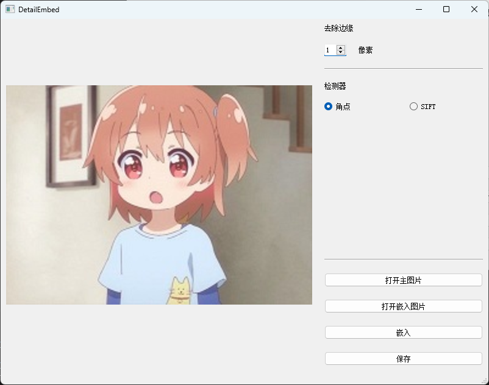
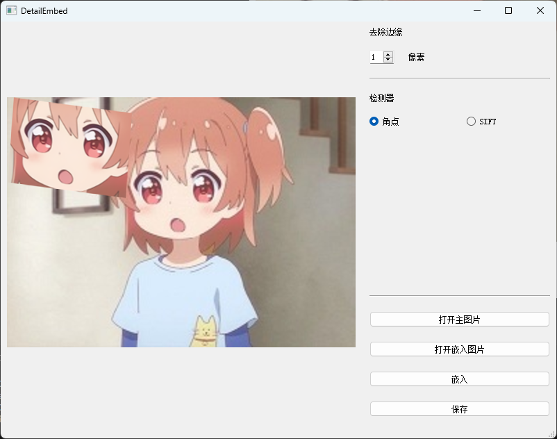
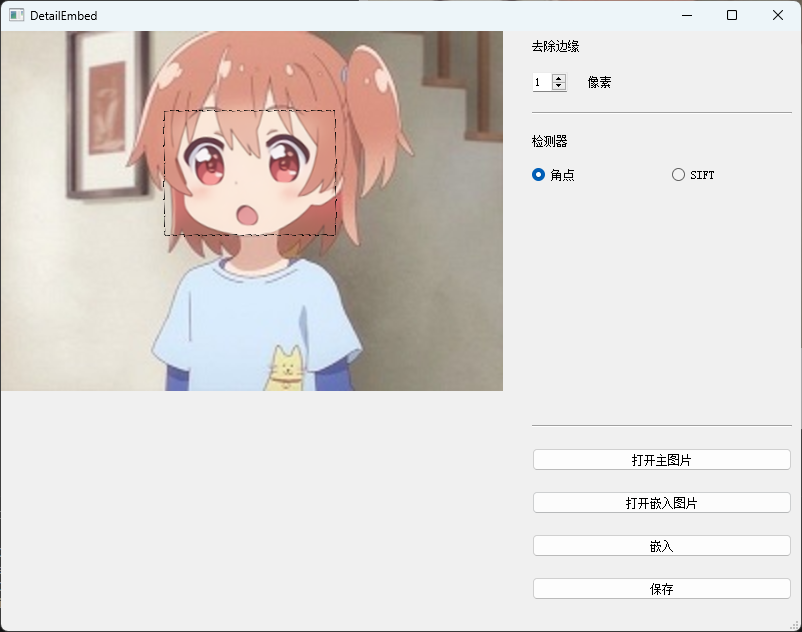

# DetailEmbed
DetailEmbed 是一个软件项目，旨在无缝地将较小的局部图像嵌入到的低分辨率的完整图像中。通过使用高清的局部图像，DetailEmbed 可以增强完整图像的局部清晰度。

## 例子
- 低分辨率的大图
  


- 高分辨率的局部小图
  
   


- 处理后的结果
  
（带黑边）

 

（不带黑边）


## 依赖
- OpenCV (cv2)
- NumPy (numpy)
- PyQt5 (for GUI)

## 用法
### GUI
#### 打开主图片
  


#### 打开要嵌入的图片
  


#### 使用鼠标左键拖动，滚轮调整大小以完全覆盖要主图片对应区域


#### 点击嵌入按钮后可继续嵌入或保存 
 


### `embed_images_to_large_image`函数
#### 参数

`big_image_path`: 大图的路径，要将小图嵌入其中。

`small_image_paths`: 要嵌入的小图的路径列表。

`small_edge_cut`: 要从小图边缘裁剪的像素数（默认为0）。

`corrosion`: 用于掩模的腐蚀核的大小，避免嵌入的黑边（默认为6）。
#### 输出
该函数返回嵌入了小图的大图。
#### 示例
```python
from src.embed_images import embed_images_to_large_image


big_image_path = "images/Low-resolution.png"
small_image_paths = [
    "images/Deformed-high-resolution-partial.png",
    "images/High-resolution-partial2.png",
]
out_image = embed_images_to_large_image(
    big_image_path, small_image_paths, small_edge_cut=0, corrosion=1
)

```
## 实现细节
- 该函数首先使用尺度不变特征转换（SIFT）算法检测大图和小图的关键点，并计算它们的描述符。
- 然后使用基于 FLANN 的匹配器在大图和小图之间匹配关键点。
- 在筛选掉不可靠的匹配项后，使用随机抽样一致性（RANSAC）算法估计仿射变换矩阵。
- 根据估计的变换矩阵对小图进行变形，然后使用掩模去除不需要的伪影。
- 最后，将变形后的小图叠加到大图的相应位置上。
